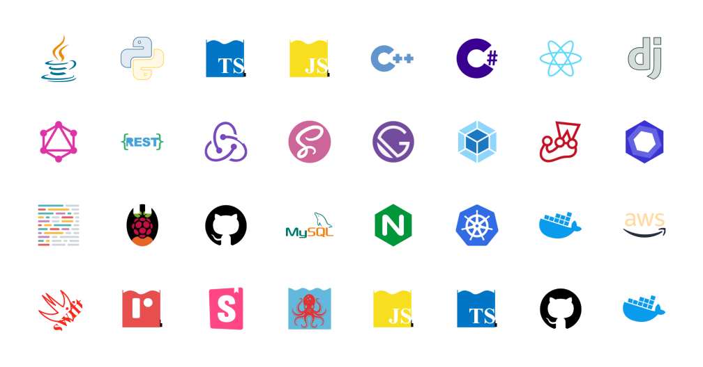

<!-- ═══════════════════════ HERO ═══════════════════════ -->

  

  

  
  
  

<!-- ═══════════════════════ ABOUT ═══════════════════════ -->
## 🌌 About Me

- 🎯 **AI Native** — Infinite progress. Pushing the boundaries of code, navigating major tech stacks, and staying on the AI frontier: LLMs, agents, multimodal models, and open-source AI.
- 🧑‍💻 **Geek at Heart** — Roaming tech blogs and communities, hanging out on GitHub, making friends and building in the open.
- 🔒 **Cybersecurity / Penetration Testing** — Dreaming of becoming a hacker. Keep the faith — believe in the power of belief.
- 🎮 **Tool Builder** — Crafting small scripts and handy tools, turning ideas into tiny working projects.

 

<!-- ═══════════════════════ TECH STACK ═══════════════════════ -->
## 💜 Tech Stack

  

<!-- ═══════════════════════ STATS ═══════════════════════ -->
## 📊 GitHub Stats

  <picture>
    <source media="(prefers-color-scheme: dark)" srcset="https://github-readme-stats-eight-theta.vercel.app/api?username=funny8kids&show_icons=true&theme=tokyonight&count_private=true&hide_border=true" />
    <source media="(prefers-color-scheme: light)" srcset="https://github-readme-stats-eight-theta.vercel.app/api?username=funny8kids&show_icons=true&count_private=true&hide_border=true&title_color=7c3aed&icon_color=8b5cf6&text_color=4c1d95&bg_color=ffffff" />
    
  </picture>
  <picture>
    <source media="(prefers-color-scheme: dark)" srcset="https://github-readme-stats-eight-theta.vercel.app/api/top-langs/?username=funny8kids&layout=compact&theme=tokyonight&hide_border=true" />
    <source media="(prefers-color-scheme: light)" srcset="https://github-readme-stats-eight-theta.vercel.app/api/top-langs/?username=funny8kids&layout=compact&hide_border=true&title_color=7c3aed&text_color=4c1d95&bg_color=ffffff" />
    
  </picture>

  <picture>
    <source media="(prefers-color-scheme: dark)" srcset="https://streak-stats.demolab.com/?user=funny8kids&theme=tokyonight&hide_border=true&date_format=%5BY.%5Dn.j" />
    <source media="(prefers-color-scheme: light)" srcset="https://streak-stats.demolab.com/?user=funny8kids&hide_border=true&date_format=%5BY.%5Dn.j&background=ffffff&ring=7c3aed&fire=e94560&currStreakLabel=7c3aed&sideLabels=6d28d9&currStreakNum=4c1d95&sideNums=4c1d95&dates=8b8b8b" />
    
  </picture>

  <picture>
    <source media="(prefers-color-scheme: dark)" srcset="https://github-profile-summary-cards.vercel.app/api/cards/profile-details?username=funny8kids&theme=tokyonight" />
    <source media="(prefers-color-scheme: light)" srcset="https://github-profile-summary-cards.vercel.app/api/cards/profile-details?username=funny8kids&theme=default" />
    
  </picture>

  <picture>
    <source media="(prefers-color-scheme: dark)" srcset="https://github-profile-summary-cards.vercel.app/api/cards/repos-per-language?username=funny8kids&theme=tokyonight" />
    <source media="(prefers-color-scheme: light)" srcset="https://github-profile-summary-cards.vercel.app/api/cards/repos-per-language?username=funny8kids&theme=default" />
    
  </picture>
  <picture>
    <source media="(prefers-color-scheme: dark)" srcset="https://github-profile-summary-cards.vercel.app/api/cards/productive-time?username=funny8kids&theme=tokyonight&utcOffset=8" />
    <source media="(prefers-color-scheme: light)" srcset="https://github-profile-summary-cards.vercel.app/api/cards/productive-time?username=funny8kids&theme=default&utcOffset=8" />
    
  </picture>

<!-- ═══════════════════════ SNAKE ═══════════════════════ -->
## 🐍 Contribution Snake

  <picture>
    <source media="(prefers-color-scheme: dark)" srcset="https://raw.githubusercontent.com/funny8kids/funny8kids/output/github-contribution-grid-snake-dark.svg" />
    <source media="(prefers-color-scheme: light)" srcset="https://raw.githubusercontent.com/funny8kids/funny8kids/output/github-contribution-grid-snake.svg" />
    
  </picture>

<!-- ═══════════════════════ FUN ═══════════════════════ -->
## ✨ A Little Fun

  <picture>
    <source media="(prefers-color-scheme: dark)" srcset="https://quotes-github-readme.vercel.app/api?type=horizontal&theme=tokyonight" />
    <source media="(prefers-color-scheme: light)" srcset="https://quotes-github-readme.vercel.app/api?type=horizontal&theme=light" />
    
  </picture>

<!-- ═══════════════════════ FOOTER ═══════════════════════ -->

  

