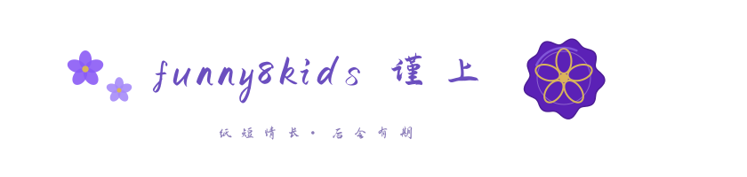

<!-- ═══════════════════════ HERO ═══════════════════════ -->

  

  

  
  
  

<!-- ═══════════════════════ ABOUT ═══════════════════════ -->
## 🌌 About Me

- 🎯 **AI Native** — 无限进步，探索代码的边界，了解各大技术栈
- 🧑‍💻 **极客爱好者** — 浏览各大博客社区，游荡 GitHub 交友社区
- 🔒 **网络安全 / 渗透测试** — 有个做 Hacker 的梦，相信相信的力量
- 🎮 **小工具爱好者** — 喜欢做一些小脚本、小工具

 

<!-- ═══════════════════════ TECH STACK ═══════════════════════ -->
## 💜 Tech Stack

  
  &nbsp;
  
  &nbsp;
  
  &nbsp;
  
  &nbsp;
  
  &nbsp;
  
  &nbsp;
  
  &nbsp;
  

  
  &nbsp;
  
  &nbsp;
  
  &nbsp;
  
  &nbsp;
  
  &nbsp;
  
  &nbsp;
  
  &nbsp;
  

  
  &nbsp;
  
  &nbsp;
  
  &nbsp;
  
  &nbsp;
  
  &nbsp;
  
  &nbsp;
  
  &nbsp;
  

<!-- ═══════════════════════ STATS ═══════════════════════ -->
## 📊 GitHub Stats

  <picture>
    <source media="(prefers-color-scheme: dark)" srcset="https://github-readme-stats-eight-theta.vercel.app/api?username=funny8kids&show_icons=true&theme=tokyonight&count_private=true&hide_border=true" />
    <source media="(prefers-color-scheme: light)" srcset="https://github-readme-stats-eight-theta.vercel.app/api?username=funny8kids&show_icons=true&count_private=true&hide_border=true&title_color=7c3aed&icon_color=8b5cf6&text_color=4c1d95&bg_color=ffffff" />
    
  </picture>
  <picture>
    <source media="(prefers-color-scheme: dark)" srcset="https://github-readme-stats-eight-theta.vercel.app/api/top-langs/?username=funny8kids&layout=compact&theme=tokyonight&hide_border=true" />
    <source media="(prefers-color-scheme: light)" srcset="https://github-readme-stats-eight-theta.vercel.app/api/top-langs/?username=funny8kids&layout=compact&hide_border=true&title_color=7c3aed&text_color=4c1d95&bg_color=ffffff" />
    
  </picture>

  <picture>
    <source media="(prefers-color-scheme: dark)" srcset="https://streak-stats.demolab.com/?user=funny8kids&theme=tokyonight&hide_border=true&date_format=%5BY.%5Dn.j" />
    <source media="(prefers-color-scheme: light)" srcset="https://streak-stats.demolab.com/?user=funny8kids&hide_border=true&date_format=%5BY.%5Dn.j&background=ffffff&ring=7c3aed&fire=e94560&currStreakLabel=7c3aed&sideLabels=6d28d9&currStreakNum=4c1d95&sideNums=4c1d95&dates=8b8b8b" />
    
  </picture>

  <picture>
    <source media="(prefers-color-scheme: dark)" srcset="https://github-profile-summary-cards.vercel.app/api/cards/profile-details?username=funny8kids&theme=tokyonight" />
    <source media="(prefers-color-scheme: light)" srcset="https://github-profile-summary-cards.vercel.app/api/cards/profile-details?username=funny8kids&theme=default" />
    
  </picture>

  <picture>
    <source media="(prefers-color-scheme: dark)" srcset="https://github-profile-summary-cards.vercel.app/api/cards/repos-per-language?username=funny8kids&theme=tokyonight" />
    <source media="(prefers-color-scheme: light)" srcset="https://github-profile-summary-cards.vercel.app/api/cards/repos-per-language?username=funny8kids&theme=default" />
    
  </picture>
  <picture>
    <source media="(prefers-color-scheme: dark)" srcset="https://github-profile-summary-cards.vercel.app/api/cards/productive-time?username=funny8kids&theme=tokyonight&utcOffset=8" />
    <source media="(prefers-color-scheme: light)" srcset="https://github-profile-summary-cards.vercel.app/api/cards/productive-time?username=funny8kids&theme=default&utcOffset=8" />
    
  </picture>

<!-- ═══════════════════════ SNAKE ═══════════════════════ -->
## 🐍 Contribution Snake

  <picture>
    <source media="(prefers-color-scheme: dark)" srcset="https://raw.githubusercontent.com/funny8kids/funny8kids/output/github-contribution-grid-snake-dark.svg" />
    <source media="(prefers-color-scheme: light)" srcset="https://raw.githubusercontent.com/funny8kids/funny8kids/output/github-contribution-grid-snake.svg" />
    
  </picture>

<!-- ═══════════════════════ FUN ═══════════════════════ -->
## ✨ A Little Fun

  <picture>
    <source media="(prefers-color-scheme: dark)" srcset="https://quotes-github-readme.vercel.app/api?type=horizontal&theme=tokyonight" />
    <source media="(prefers-color-scheme: light)" srcset="https://quotes-github-readme.vercel.app/api?type=horizontal&theme=light" />
    
  </picture>

<!-- ═══════════════════════ FOOTER ═══════════════════════ -->

  

